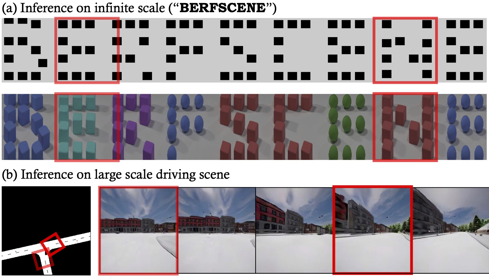

# BerfScene: Bev-conditioned Equivariant Radiance Fields for Infinite 3D Scene Generation (CVPR 2024)

[Project website](https://zqh0253.github.io/BerfScene) |  [Paper](https://arxiv.org/abs/2312.02136) | [Huggingface Demo](https://huggingface.co/spaces/qihang/BerfScene)



## Installation

To install and activate the environment, run the following command:

```
conda create -n berfscene python=3.7
conda activate berfscene
pip install torch==2.0.0 torchvision==0.15.1 torchaudio==2.0.1 --index-url https://download.pytorch.org/whl/cu118
pip install -r requirements.txt
```

You may have to modify the torch version to match your hardware requirements.

## Training

### Dataset structure

We follow the data structure defined in [Hammer](https://github.com/bytedance/Hammer). For detailed instructions on dataset preparation, please refer to the [dataset preparation documentation](https://github.com/bytedance/Hammer/blob/main/docs/dataset_preparation.md) in the Hammer repository. We provide [Clevr dataset](https://www.dropbox.com/scl/fi/exjud5818yjr9qg2b9q96/clevr_v5.zip?rlkey=ul88iyzvmy1e9dkmdxtt02irq&st=j78qhr3b&dl=0) that we used for training as a reference.

### Training BerfScene

Run

```
./scripts/training_demos/berfscene.sh 8 <DATASET_PATH> --job_name=berfscene 
 --keep_ckpt_num -1  --data_workers 2 --r1_gamma=1 --batch_size 8
 --semantic_nc 14 --ray_start 6 --ray_end 17 --focal 4.1015625 
 --kernel_size 3 --hidden_dim 256
```
to launch the training. In order to train using a dataset with customized rendering, you may need to modify the parameters: 
+ `ray_start`: the distance to the nearest point on the ray from the camera. 
+ `ray_end`: the distance to the farest point on the ray from the camera.
+ `focal`: focal length of the camera.

to align with the camera distribution.


## Inference

We provide a [Huggingface online demo](https://huggingface.co/spaces/qihang/BerfScene) where you can inference our model to create large-scale 3D scene.


## Bibtex

```
@article{zhang2024berfscene,
         author = {Qihang Zhang and Yinghao Xu and Yujun Shen and Bo Dai and Bolei Zhou and Ceyuan Yang},
         title = {{BerfScene}: Generative Novel View Synthesis with {3D}-Aware Diffusion Models},
         booktitle = {CVPR},
         year = {2024}
}
```
